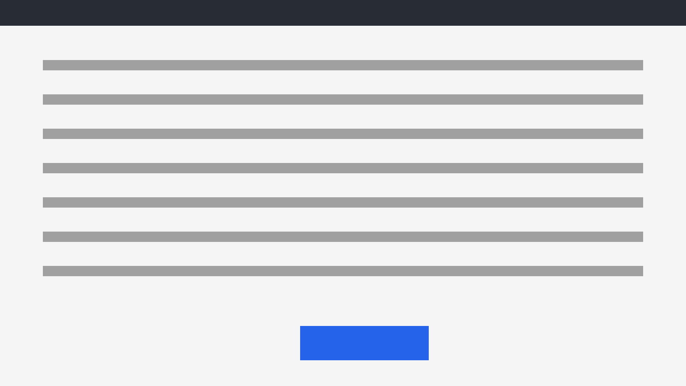

# Vaiheet

Vaiheittaisen ohjeen koesivu (tests/test_walkthrough.py). Ei SUMMARY.md:ssä,
jotta muiden testien laskemat luvut ja lohkot eivät muutu. Luvun Kuvat
vaiheissa on kuvia, jotka avautuvat suurina (kirja.toml: kuvasuurennus), sekä
samat merkinnät kuin kirjojen oikeissa ohjeissa.

<walkthrough scenes="images/vaiheet.js" audio>

## Alku

<step scene="selain">

### Avaa sivu

Ensimmäisen vaiheen teksti.

</step>

<step scene="komento">

### Anna komento

```bash
git status
```

</step>

## Loppu

<step scene="piilotus">

### Kirjaudu

> [!HUOMAUTUS]
> Alertti vaiheen sisällä.

</step>

## Kuvat

<step scene="kuvakaappaus">

### Katso kuvakaappaus

Ikkuna näyttää tältä:



</step>

<step scene="tallennus">

### Tallenna tiedosto

Valitse *Tiedosto* › *Tallenna* tai paina <kbd>Ctrl</kbd> + <kbd>S</kbd>.

- `.git/` on **paikallinen** varasto.
- `a.txt` on uusi tiedosto.

> [!VAROITUS]
> 1. Polku on *suhteellinen*.
> 2. Lisää tiedosto:
>
>     ```bash
>     git add a.txt
>     ```

</step>

<step scene="tarkistus">

### Vertaa tulosta

Palaa tarvittaessa vaiheeseen [Avaa sivu](#avaa-sivu) tai lue
[ensimmäinen luku](01-hei.md). Pieni kuva:

{ width="200" }

</step>

</walkthrough>

## Animaatio

Yksittäinen animaatio toisella välilehdellä listan kohdassa.

### [Eka](#tab/eka)

Ensimmäinen välilehti.

***

### [Toka](#tab/toka)

1. Kohta

    <animation scenes="images/vaiheet.js" scene="animaatio">

    

    </animation>

***
